# Single-Cycle MIPS Processor — FPGA Implementation (Nexys A7)

A single-cycle 32-bit MIPS processor implemented in Verilog HDL, synthesized and implemented on a Digilent Nexys A7-100T FPGA board (Xilinx Artix-7), with live hardware debug via switches and a seven-segment display.

## Overview

This project implements a classic single-cycle MIPS datapath in Verilog and takes it all the way from RTL design through simulation, synthesis, and **physical FPGA implementation** — including timing closure, resource utilization, and power analysis on real hardware. It is not simulation-only: the design has been placed, routed, and verified to meet timing on a Nexys A7 board.

**Tools used:** Xilinx Vivado 2018.2, Verilog HDL, XSim, target device `xc7a100tcsg324-3` (Nexys A7-100T)

## Key Highlight: Real Hardware Debug Interface

Unlike a typical simulation-only class project, this design includes a working **on-board debug interface**:
- Manual step-clock via push-button (step through instructions one at a time)
- Slide switches select which register or memory location to inspect
- Seven-segment display shows the live 32-bit value of the selected register/memory word

This turns the processor into something you can physically interact with on the board — press the button, watch registers update in real time on the display.

## Supported Instruction Set

| Type | Instructions |
|---|---|
| R-Type | ADD, SUB, AND, OR, SLT |
| I-Type | ADDI |
| Load/Store | LW, SW |
| Branch | BEQ |
| Jump | J |

## Architecture

Classic single-cycle MIPS datapath: Program Counter → Instruction Memory → Register File / Sign Extend → ALU → Data Memory → Write-back, coordinated by a Control Unit and separate ALU Control unit.

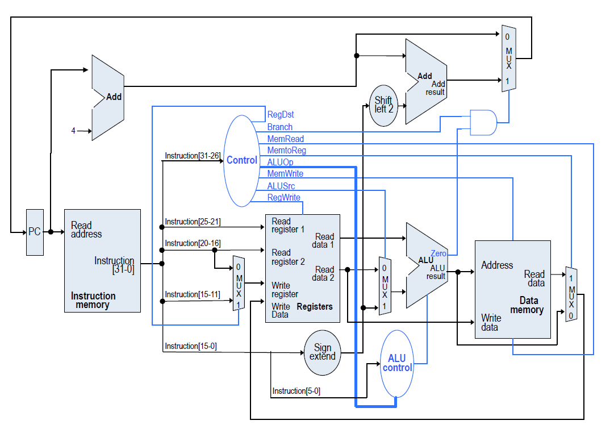

**Module breakdown:**

| Module | File | Description |
|---|---|---|
| Program Counter | [`rtl/program_counter.v`](rtl/program_counter.v) | Synchronous PC register with reset |
| PC Adder | [`rtl/pc_adder.v`](rtl/pc_adder.v) | Computes PC+4 |
| Instruction Memory | [`rtl/instruction_memory.v`](rtl/instruction_memory.v) | 256-word instruction ROM, loaded via `$readmemh` from `program.mem` |
| Register File | [`rtl/register_file.v`](rtl/register_file.v) | 32 x 32-bit registers with debug read port |
| Sign Extend | [`rtl/sign_extend.v`](rtl/sign_extend.v) | Sign-extends 16-bit immediates to 32-bit |
| Control Unit | [`rtl/control_unit.v`](rtl/control_unit.v) | Decodes opcode into datapath control signals |
| ALU Control | [`rtl/alu_control.v`](rtl/alu_control.v) | Refines ALU operation from ALUOp + funct field |
| ALU | [`rtl/alu.v`](rtl/alu.v) | ADD/SUB/AND/OR/SLT, generates Zero flag for branch |
| Data Memory | [`rtl/data_memory.v`](rtl/data_memory.v) | 64-word data memory with debug read port |
| MIPS Processor (core) | [`rtl/mips_processor.v`](rtl/mips_processor.v) | Integrates all modules into the complete datapath |
| FPGA Top Wrapper | [`rtl/FPGA_MIPS_Top.v`](rtl/FPGA_MIPS_Top.v) | Board-level wrapper: clock debouncing, switch input, seven-segment output |
| Seven-Segment Controller | [`rtl/SevenSegmentController.v`](rtl/SevenSegmentController.v) | Multiplexed 8-digit seven-segment display driver |

## Test Program

The instruction memory ([`program/program.mem`](program/program.mem)) is preloaded with the following test program:

```
addi $t0, $zero, 5       ; $t0 = 5
addi $t1, $zero, 3       ; $t1 = 3
add  $t2, $t0, $t1       ; $t2 = 8
sub  $t3, $t0, $t1       ; $t3 = 2
and  $t4, $t0, $t1       ; $t4 = 1
or   $t5, $t0, $t1       ; $t5 = 7
slt  $t6, $t1, $t0       ; $t6 = 1  ($t1 < $t0)
sw   $t2, 0($zero)       ; Mem[0] = 8
lw   $s0, 0($zero)       ; $s0 = 8
beq  $t0, $t0, +1        ; branch taken
j    end                 ; jump
addi $s1, $zero, 0xAB    ; $s1 = 0xAB
```

This exercises every supported instruction type: arithmetic, logical, comparison, memory access, branch, and jump.

## Simulation

Verified in Xilinx Vivado XSim using a testbench ([`testbench/tb_mips_processor.v`](testbench/tb_mips_processor.v)) that steps through execution and monitors registers `$t0`–`$t3` via the processor's debug read port as the program executes.

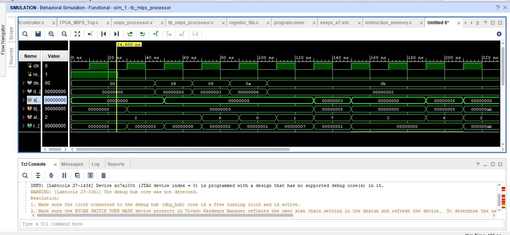

## FPGA Implementation Results

The design was fully placed, routed, and implemented targeting the Nexys A7-100T board ([`reports/`](reports) folder has the complete Vivado reports):

| Metric | Result |
|---|---|
| Target device | Artix-7 `xc7a100tcsg324-3` |
| Timing | **All user-specified constraints met** — Worst Negative Slack: +7.611 ns |
| Slice LUTs | 863 / 63,400 (1.36%) |
| Slice Registers | 268 / 126,800 (0.21%) |
| Total on-chip power | 0.131 W (0.033 W dynamic, 0.097 W static) |
| Routing | 1,212/1,212 nets fully routed, 0 routing errors |

This confirms the design is not just functionally correct in simulation — it's been physically synthesized, placed, and routed on real FPGA hardware with timing closure achieved.

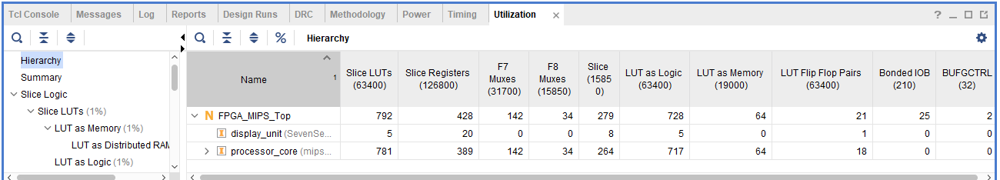

## Hardware Demonstration

The processor was programmed onto a **physical Nexys A7 board** and each instruction's execution was captured live on the seven-segment display. This is real hardware output, not simulation.

| Instruction | Board Output |
|---|---|
| `addi $t0, $zero, 5` → $t0 = 5 | 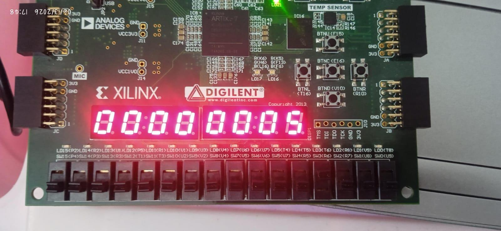 |
| `addi $t1, $zero, 3` → $t1 = 3 | 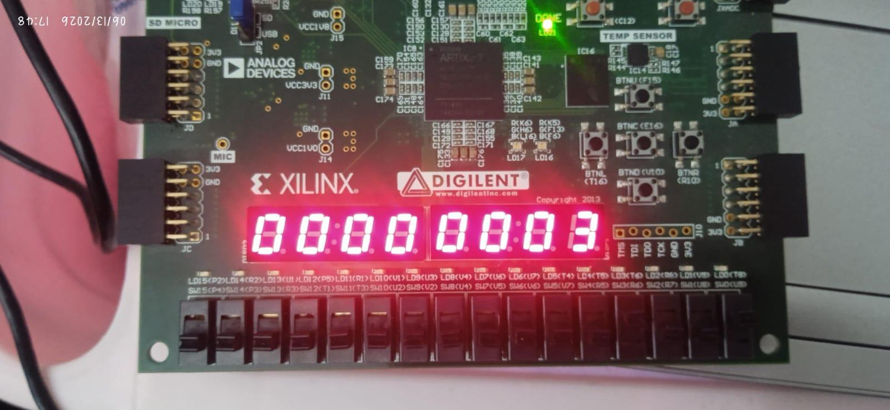 |
| `add $t2, $t0, $t1` → $t2 = 8 | 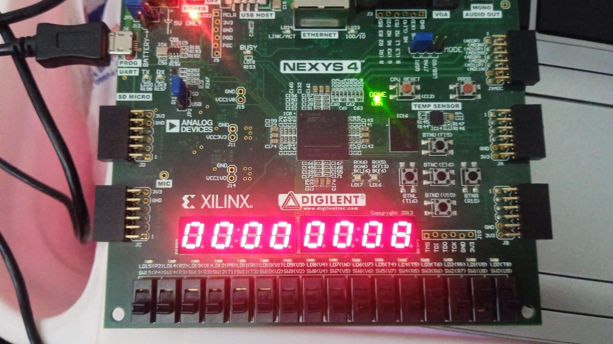 |
| `sub $t3, $t0, $t1` → $t3 = 2 | 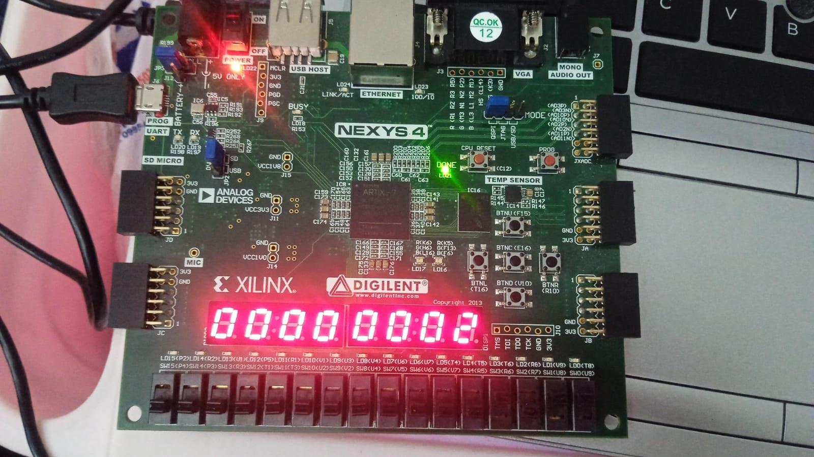 |
| `and $t4, $t0, $t1` → $t4 = 1 | 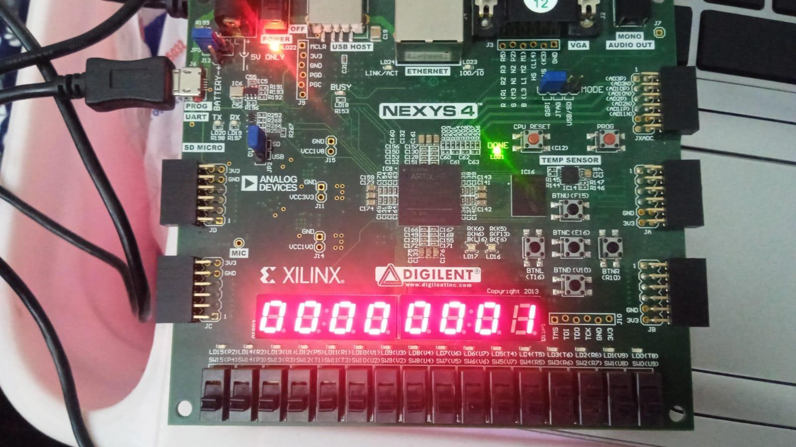 |
| `or $t5, $t0, $t1` → $t5 = 7 | 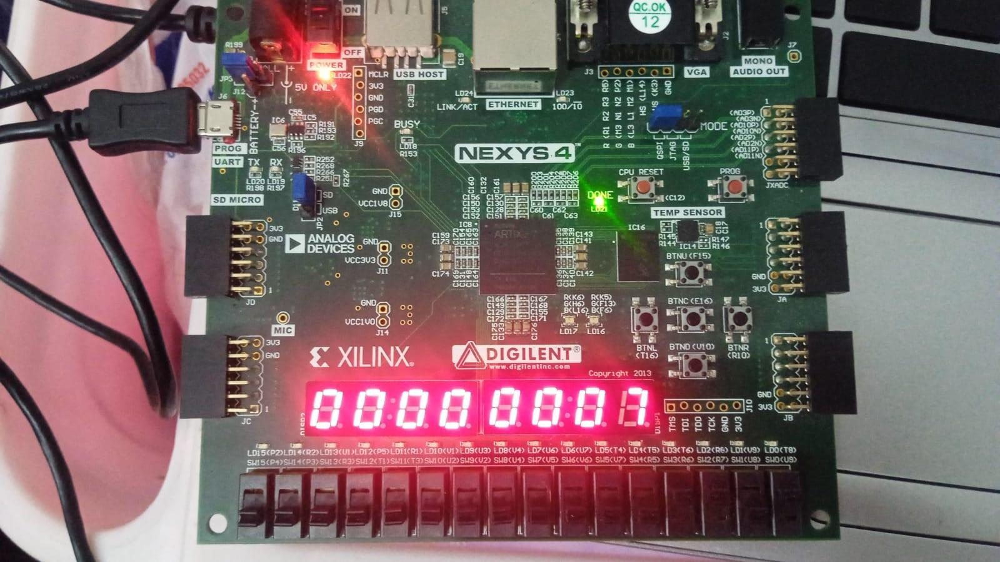 |
| `slt $t6, $t1, $t0` → $t6 = 1 | 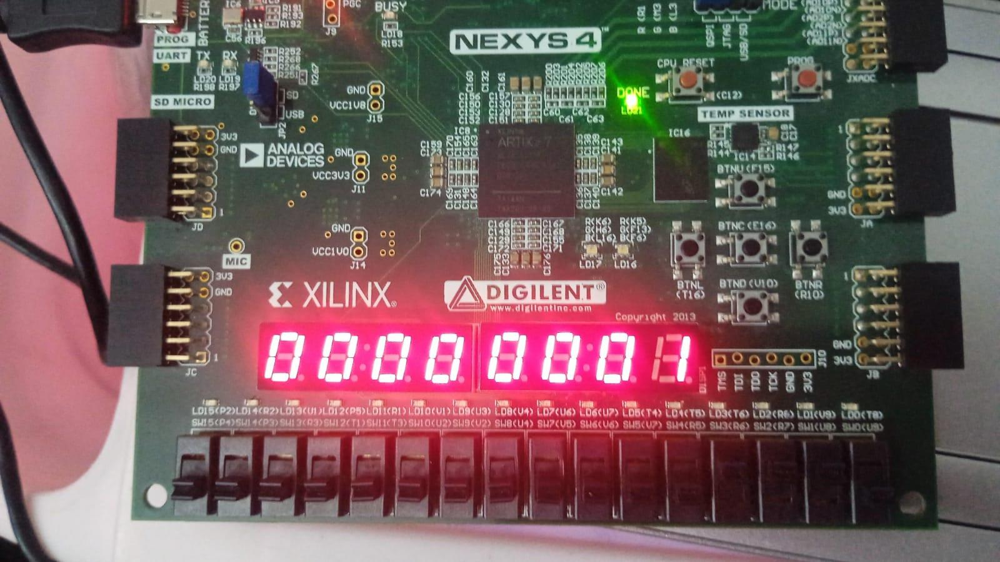 |
| `sw $t2, 0($zero)` / `lw $s0, 0($zero)` → Mem[0] = 8 | 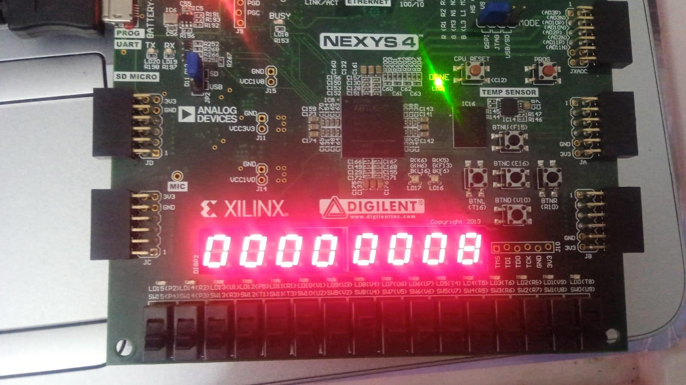 |
| `beq $t0, $t0, +1` → branch taken | 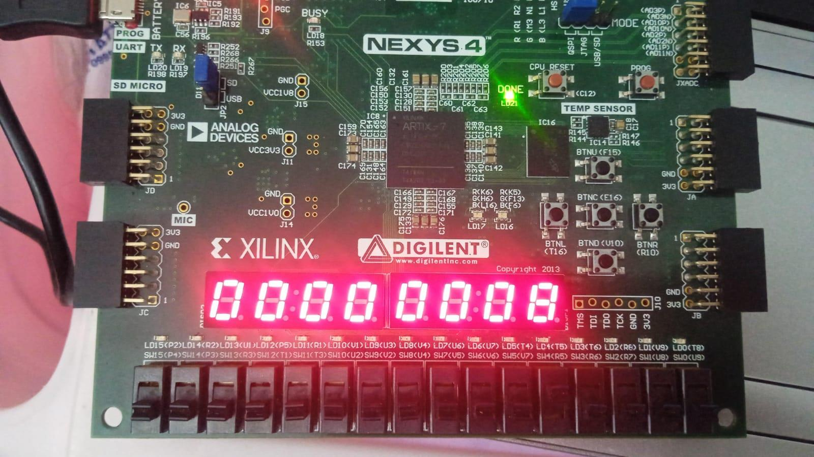 |
| `addi $s1, $zero, 0xAB` → $s1 = 0xAB (final state) | 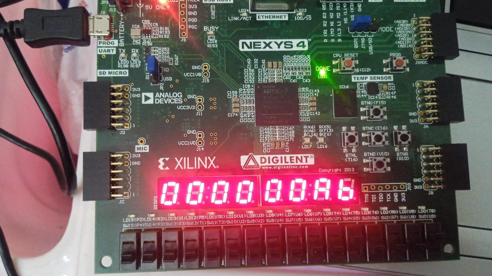 |

*(`j end` produces no visible display change since it only alters program flow.)*

## Board I/O (see [`constraints/nexys_a7.xdc`](constraints/nexys_a7.xdc))

| Signal | Board Feature | Function |
|---|---|---|
| `CLK100MHZ` | On-board 100MHz oscillator | System clock |
| `reset` | BTNC (center button) | Hardware reset |
| `clk` | BTND (down button) | Manual step-clock (single-step execution) |
| `sw[4:0]` | Slide switches | Select register/memory address to inspect |
| `sw5` | Slide switch | Toggle register view vs. memory view |
| `an`, `seg`, `dp` | Seven-segment display | Displays selected register/memory value |

## Repository Structure

```
.
├── rtl/                     # All Verilog design modules + FPGA top wrapper
├── testbench/               # Simulation testbench
├── constraints/              # Xilinx .xdc pin/timing constraints (Nexys A7)
├── program/                 # Preloaded test program (machine code)
├── reports/                 # Vivado implementation reports (utilization, timing, power)
└── README.md
```

## Design Decisions

- Single-cycle execution model, 32-bit MIPS datapath
- Separate instruction and data memory
- Debug ports added to Register File and Data Memory for live hardware inspection
- Manual step-clock (rather than free-running) to allow instruction-by-instruction observation on hardware
- Seven-segment display multiplexed across 8 digits to show full 32-bit values

## Possible Extensions

- Expand instruction support (more R-type functions, additional I-type/J-type instructions, exceptions)
- Convert to a pipelined implementation with hazard detection and forwarding
- Add UART output for logging execution trace instead of only seven-segment display
- Extend data memory and add memory-mapped I/O

---
*Developed as a Digital System Design course project. Simulated in Xilinx Vivado XSim and fully implemented on Nexys A7-100T FPGA hardware.*
